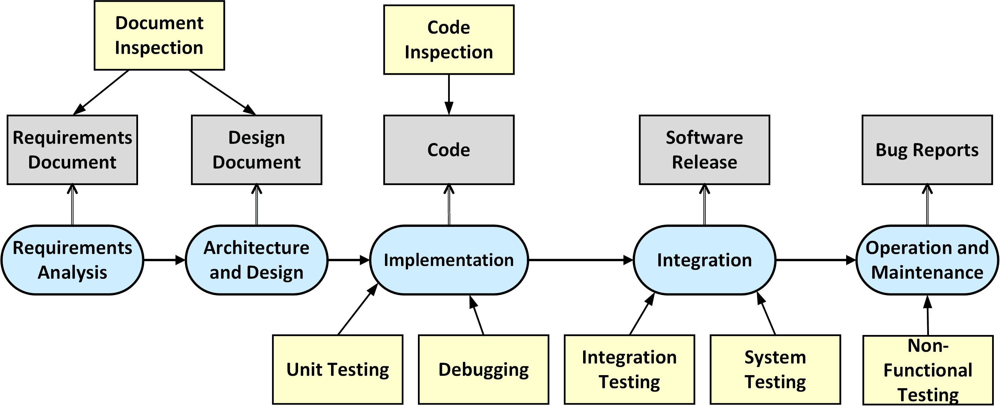

# Software Testing in Python

This repository collects examples, exercises and model solutions needed to understand
the concepts of software testing and code inspection in the software development lifycycle.

The following topics will be covered:

1. **Introduction**
    * [Linux Platform](introduction/linux)

    * [Python Tutorial](introduction/python)

2. **Debugging**
    * [Introduction](debugging)

3. **Software Inspection**
    * [Introduction](inspection)

4. **Software Testing**
    * [Introduction](testing)

    * [Unit Tests](testing/unittests)

    * [Integration Tests](testing/integrationtests)

    * [System Tests](testing/systemtests)

    * Non-Functional Tests
        * [Load Tests](testing/loadtests/)
        * [Security Tests](https://github.com/teiniker/teiniker-lectures-securitytesting)

There is a separate [setup](setup) directory in which the instructions can be found for **installing and configuring** the required tools and libraries.

As a development environment, you can use a pre-configured Debian 11 Linux VM image:
[Virtual Lab](https://drive.google.com/drive/folders/1AzsF4Mvh1HJ8k6OW5W5hQ5CF0HdqA51l)

## References
* Glenford J. Myers, Corey Sandler, Tom Badgett.**The Art of Software Testing**. Wiley, 3rd edition 2012
* Lisa Crispin, Janet Gregory. **Agile Testing**. Addison Wesley, 2009
* Andreas Zeller. **Why Programs Fail - A Guide to Systematic Debugging**. dpunkt.verlag, 2009

*Egon Teiniker, 2020-2024, GPL v3.0*
