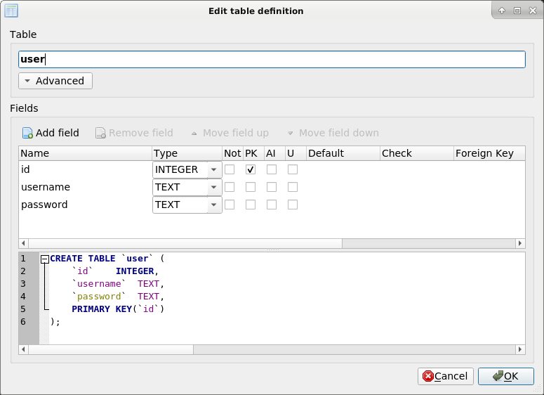
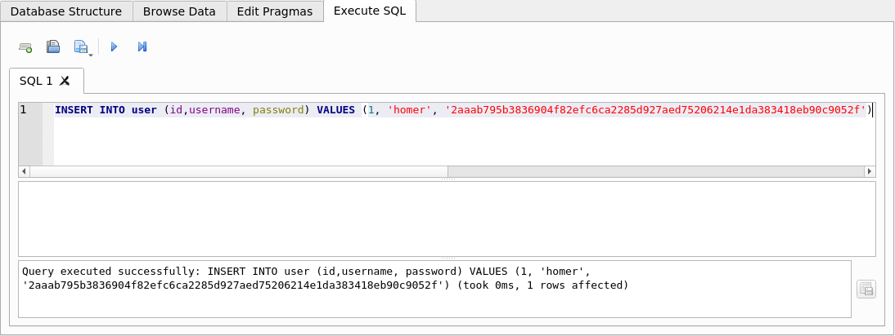
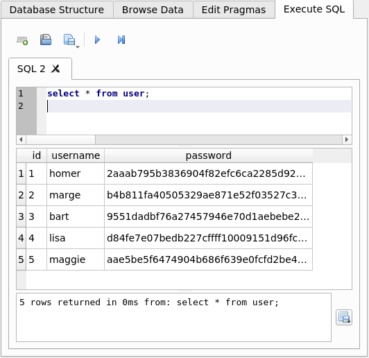

# SQLite 

SQLite is a software package that provides a **relational database management system (RDBMS)**. 
Relational database systems are used to store user-defined records in large tables. 
In addition to data storage and management, a database engine can process complex **query commands** 
that combine data from multiple tables to generate reports and data summaries.

SQLite is defined by the following features: 
* **Serverless**: SQLite does not require a separate server process or system to operate. 
    The SQLite library accesses its storage files directly. 
    
* **Zero Configuration**: No server means no setup. 
    Creating an SQLite database instance is as easy as opening a file. 
    
* **Cross-Platform**: The entire database instance resides in a single cross-platform file, 
    requiring no administration. 
    
* **Self-Contained**: A single library contains the entire database system, which integrates 
    directly into a host application.

* **Small Runtime Footprint**: The default build is less than a megabyte of code and requires only 
    a few megabytes of memory. With some adjustments, both the library size and memory use can be 
    significantly reduced. 
    
* **Transactional**: SQLite transactions are fully ACID-compliant, allowing safe access from 
    multiple processes or threads. 
    
* **Full-Featured**: SQLite supports most of the query language features found in the **SQL92 standard**. 


## Structured Query Language 

The Structured Query Language (SQL) is the main means of interacting with nearly all modern 
relational database systems. 
SQL provides commands to configure the tables, indexes, and other data structures within the 
database. 
SQL commands are also used to insert, update, and delete data records, as well as query those 
records to look up specific data values.

All interaction with a relational database is done through the SQL language. 
This is true when **interactively typing commands** or when using the **programming API**.

### SQL by Example

We take the first steps in SQL with the help of the **DB Browser for SQLite** tool.

A new database is saved in a `test.db` file and an SQL schema is created for a `user` table.

```SQL
CREATE TABLE user (id INTEGER, username TEXT, password TEXT, PRIMARY KEY(id))
```

We can also create the table interactively using the DB Browser.


To insert data into the user table, we use the `INSERT` statement.
```SQL
INSERT INTO user (id,username, password) VALUES (1, 'homer', '2aaab795b3836904f82efc6ca2285d927aed75206214e1da383418eb90c9052f');
INSERT INTO user (id,username, password) VALUES (2, 'marge', 'b4b811fa40505329ae871e52f03527c3720c9af7fb8607819658535c5484c41e');
INSERT INTO user (id,username, password) VALUES (3, 'bart', '9551dadbf76a27457946e70d1aebebe2132f8d3bce6378d216c11853524dd3a6');
INSERT INTO user (id,username, password) VALUES (4, 'lisa', 'd84fe7e07bedb227cffff10009151d96fc944f6a1bd37cff60e8e4626a1eb1c3');
INSERT INTO user (id,username, password) VALUES (5, 'maggie', 'aae5be5f6474904b686f639e0fcfd2be440121cd889fa381a94b71750758345e');
```
In the tab _SQL Execute_ we can execute one or more SQL statements. 
Note that there is a semicolon `;` between SQL statements.



The table data can be viewed in the _Browse Data_ tab.

With the `SELECT` statement, data can be read from the table and filtered by the `WHERE` clause.

```SQL
SELECT * FROM user

SELECT id,username FROM user;

SELECT id,username,password FROM user WHERE id=3;

SELECT id,username,password FROM user WHERE username LIKE 'm%'
```


The `UPDATE` statement can be used to change data in the table.
```SQL
UPDATE user SET password=1234567 WHERE id=3
```

To remove individual records from the table, we use the `DELETE` statement.
```SQL
DELETE FROM user WHERE id=1
```

Finally, we can delete the entire table from the database with the `DROP TABLE` statement.
```SQL
DROP TABLE user
```

## DB-API 2.0 interface for SQLite

The **sqlite3** module provides a SQL interface compliant with the DB-API 2.0 specification described by PEP 249.

To use the module, you must first create a `Connection` object that represents the database.
We can also supply the special name `:memory:` to create a database in RAM.
```Python
conn = sqlite3.connect(DATABALE_NAME)
```

Once we have a `Connection`, we can create a `Cursor` object and call its `execute()` method 
to perform SQL commands:
```Python
cursor = conn.cursor()
# Create a database table
cursor.execute("CREATE TABLE user (id INTEGER, username TEXT, password TEXT, PRIMARY KEY(id))")

# Insert data into the database table
cursor.execute("INSERT INTO user (id,username, password) VALUES (1, 'homer' '2aaab795b3836904f82efc6ca2285d927aed75206214e1da383418eb90c9052f')")

# Commit the changes and close the connection
conn.commit()
conn.close()
```

Usually our SQL operations will need to **use values from Python variables**. 
We shouldn’t assemble our query using Python’s string operations because doing so is insecure; it makes your program vulnerable to an **SQL injection attack**.

We put `?` as a **placeholder** wherever we want to use a value, and then 
provide a **tuple of values** as the second argument to the cursor’s `execute()` method. 
```
parameters = ('m%',)
cursor.execute("SELECT * FROM user WHERE username LIKE ?", parameters)
table = cursor.fetchall()
```

To retrieve data after executing a `SELECT statement`, we can either treat the 
cursor as an iterator, call the cursor’s `fetchone()` method to retrieve a single matching row, or call `fetchall()` to get a list of the matching rows.

* **fetchone()**: 
    Fetches the next row of a query result set, returning a **tuple**, or None when no more data is available.

* **fetchall()**:
Fetches all (remaining) rows of a query result, returning a **list of tuples**. Note that the cursor’s arraysize attribute can affect the performance of this operation. An empty list is returned when no rows are available.

## References
* [DB Browser for SQLite](https://sqlitebrowser.org/)
* [sqlite3 — DB-API 2.0 interface for SQLite databases](https://docs.python.org/3.8/library/sqlite3.html)
* [SQLite: Tutorial](https://www.sqlitetutorial.net/)
* [SQLite:In-Memory Databases](https://www.sqlite.org/inmemorydb.html)

* [Youtube (Corey Schafer): Python SQLite Tutorial: Complete Overview - Creating a Database, Table, and Running Queries](https://youtu.be/pd-0G0MigUA)
* [Youtube: SQLite Databases With Python](https://youtu.be/byHcYRpMgI4)

*Egon Teiniker, 2020-2023, GPL v3.0*